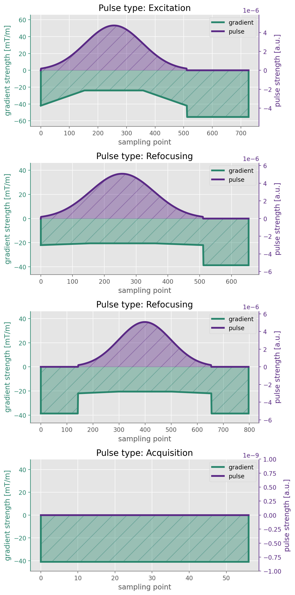
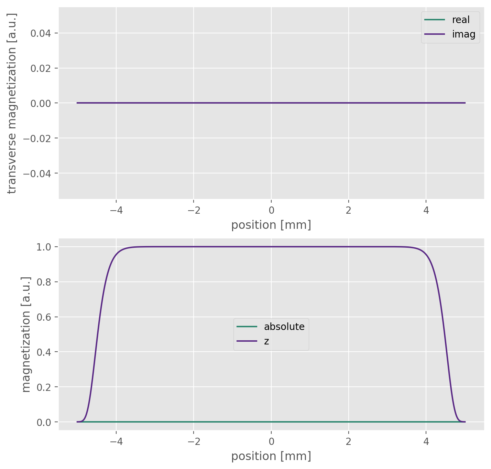
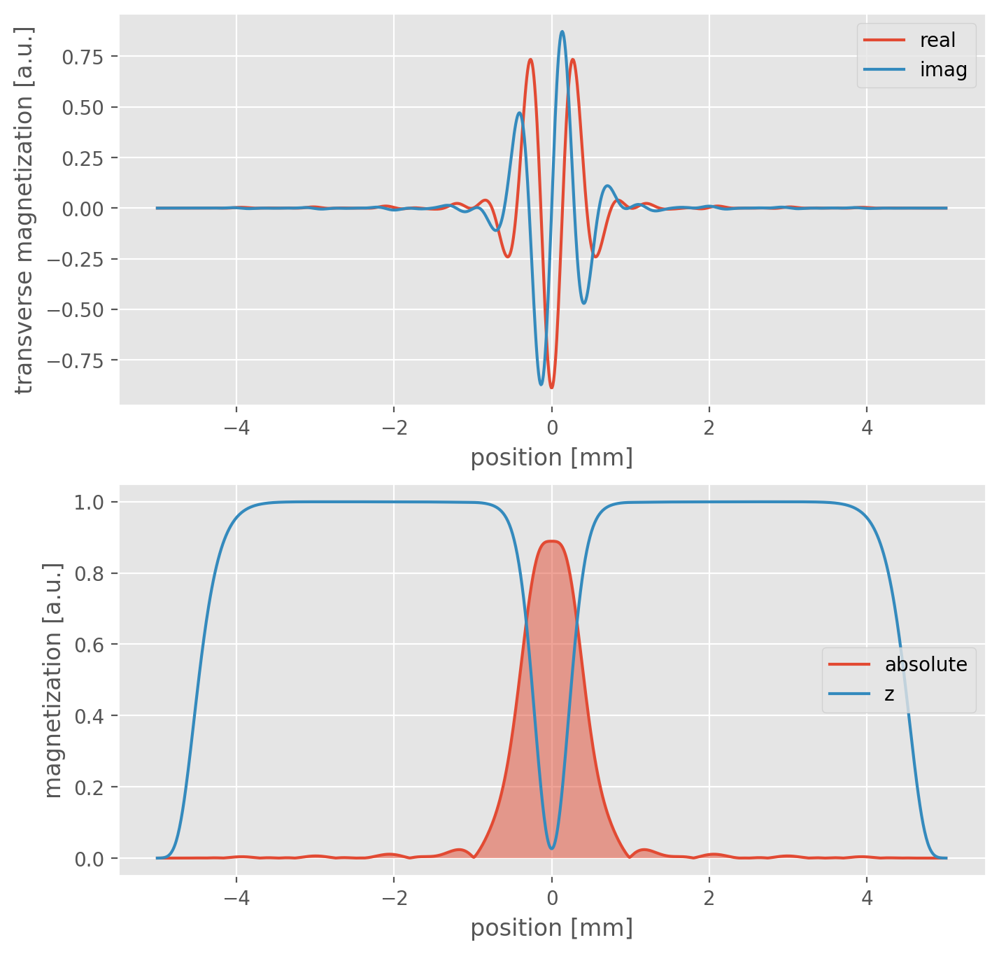
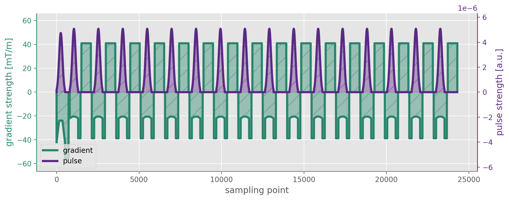
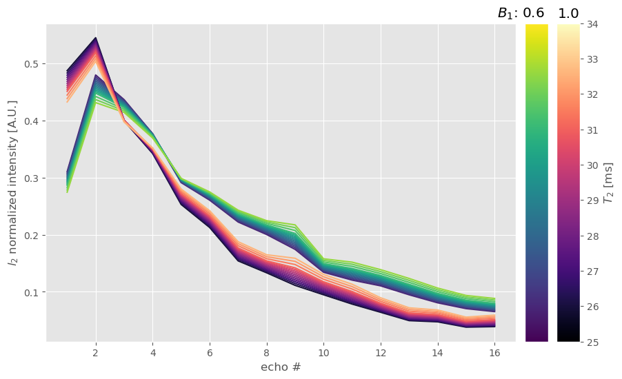

# Example usage

Provided is an exemplary configuration File *SimulationConfiguration.json*,

with

```python -m emc_sim --configFile /examples/SimulationConfiguration.json```

(note: working directory is the parent dir of the package *../emc_simulation/*)

A simulation runs which would generate 38 curves.
Note the T<sub>2</sub> values simulated range from 20 - 35 ms. However from 20 - 25 in steps of 0.5 ms. From 25 - 35 in steps of 2 ms. The equivalent definition of this range is given in the config (line 51) via:
```
"t2_list": [ [ 20, 25, 0.1 ], [ 25, 35, 2 ] ],
```
Thus a wide range of T<sub>2</sub> values with varying step size can be created.

### Pulse Files
- The easiest way providing pulse shapes is via a (.txt) file consisting of tab delimited amplitude and phase values (see [external](../external/) folder.
- If the visualization flag is set in the configuration it is easy to check the correct pulse input from the plotting of the pulse gradient data:



for the given gaussian shape pulse

- Pulses can also be created via python (eg Gauss or Sync shapes) and fed as array into the `functions.pulseCalibrationIntegral` function. It is probably best understood checking the `prep` file.

### Sample & Pulse Profile
- The initialized sample (left column) is also displayed when the visualization flag is turned on. The sample changes size with the defined slice thickness (*SimulationConfiguration.settings.lengthZ*, i.e. `--lengthZ` when using the CLI)
- Additionally a small code change would yield plots of the pulse profiles during the simulation to evaluate the magnitude evolution (not recommended for simulations with high number of curves or ETL)
- ToDo: add magnetization propagation evaluation visuals

| Sample Initialization         | Excitation Profile          |
| ---------------------         | ------------------          |
|   |   |
|    | parameters: B1: 1.0, T2: 0.02  |

### Sequence
- For the simulation a detailed knowledge of the gradient and pulses is necessary. The Values are set in *SimulationConfiguration.sequence*.
- For Siemens sequences this can be obtained from *IDEA* sequence simulations. The values are then read of in the event blocks. (ToDo: insert image)
- The sequence can once again be checked visually if the flag ist set

Plotted are temporal sampling points, the acquisition is shifted in *z* -  direction, hence only *z* - gradients are shown here

### Generated Database
- The Algorithm simulates a database for all given T1, T2, B1 (,D) Combinations which is stored in *SimulationConfiguration.config.savePath/saveFile*. It can be loaded in python via

```
pd_database, np_database = emc_sim.utils.load_database(path/to/database, append_zero=False)
```

returning a pandas Dataframe and a numpy version of the created curves.
This is also a good testcase for a small number of simulation parameters: i.e. if B<sub>1</sub><sup>+</sup> is varied quite drastically (like on default between 0.6 and 1.0) the curves should show the dramatic influence of the stimulated echoes:


