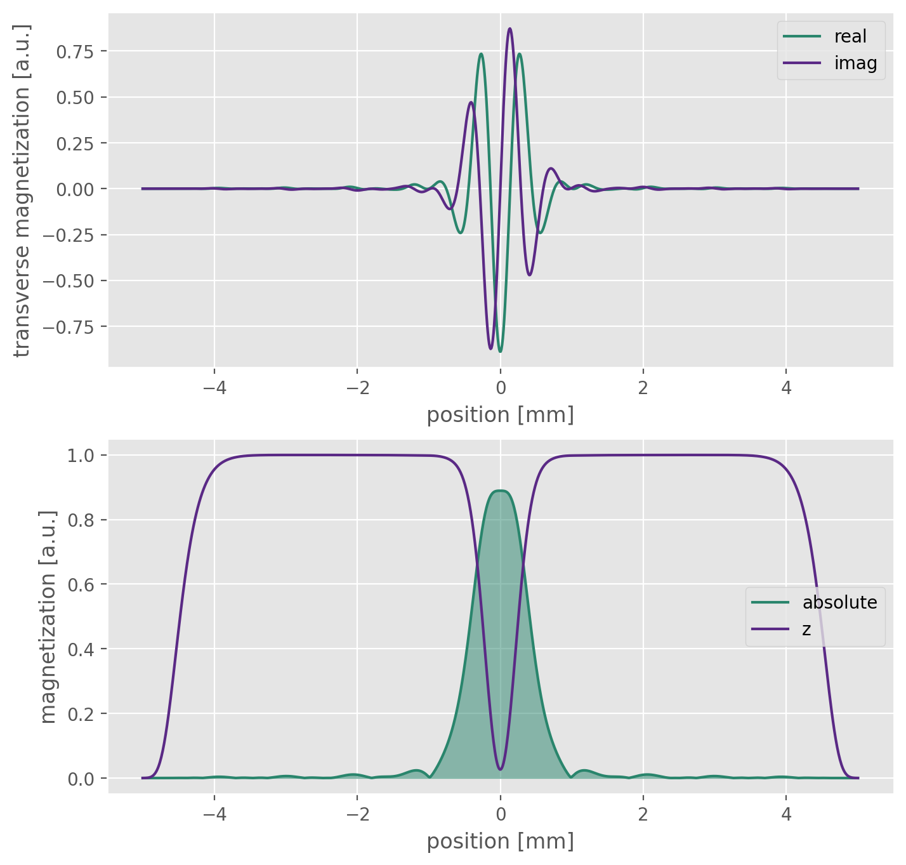

# Example usage

Provided is an exemplary configuration File *SimulationConfiguration.json*,

with

```python -m emc_sim --configFile /examples/SimulationConfiguration.json```

(note: working directory *../emc_simulation/*)

A simulation runs which would generate 38 curves.
Note the T~2~ values simulated range from 20 - 35 ms. However from 20 - 25 in steps of 0.5 ms. From 25 - 35 in steps of 2 ms. The equivalent definition of this range is given in the config (line 51) via:
```
"t2_list": [ [ 20, 25, 0.1 ], [ 25, 35, 2 ] ],
```
Thus a wide range of T~2~ values with varying step size can be created.

### Pulse Files
- The easiest way providing pulse shapes is via a (.txt) file consisting of tab delimited amplitude and phase values (see *external/* folder).
- If the visualization flag is set in the configuration it is easy to check the correct pulse input from the plotting of the pulse gradient forms:


for the given gaussian shape pulse

- Pulses can also be created via python (eg Gauss or Sync shapes) and fed as array into the `functions.pulseCalibrationIntegral` function

### Sample & Pulse Profile
- The initialized sample (left column) is also displayed when the visualization flag is turned on. The sample changes size with the defined slice thickness (*SimulationConfiguration.settings.lengthZ*)
- Additionally a small code change would yield plots of the pulse profiles during the simulation to evaluate the magnitude evolution (not recommended simulations with high number of curves or ETL)
- ToDo: add magnetization propagation evaluation visuals

| Sample Initialization         | Excitation Profile          |
| ---------------------         | ------------------          |
|   |   |
|    | parameters: B1: 1.0, T2: 0.02  |

### Sequence
- For the simulation a detailed knowledge of the gradient and pulses is necessary. The Values are set in *SimulationConfiguration.sequence*.
- For Siemens sequences this can be obtained from *IDEA* sequence simulations. The valuesa re then read of in the event blocks. (ToDo: insert image)
- The sequence can once again be checked visually if the flag ist set

Plotted are temporal sampling points, the acquisition is shifted in *z* -  direction, hence only *z* - gradients are shown here 

### Generated Database
- The Algorithm simulates a database for all given T1, T2, B1 (,D) Combinations which is stored in *SimulationConfiguration.config.savePath/saveFile*. It can be loaded in python via

```
pd_database, np_database = emc_sim.utils.load_database(path/to/database, append_zero=True)
```

returning a pandas Dataframe and a numpy version of the created curves. By Default 0 curves are appended for enhanced fitting of sample free regions.
